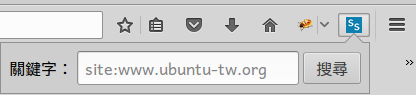

# webextension-search-site

WebExtension Search Site


## install git

``` sh
$ sudo apt-get install git
```


## clone

``` sh
$ git clone https://github.com/samwhelp/webextension-practice.git
```


## install for firefox

請閱讀「[INSTALL.firefox.md](https://github.com/samwhelp/webextension-search-ubuntu-tw/blob/master/doc/INSTALL.firefox.md)」


## install for chrome or chromium

請閱讀「[INSTALL.chrome.md](https://github.com/samwhelp/webextension-search-ubuntu-tw/blob/master/doc/INSTALL.chrome.md)」

註：因為「firefox/[browser.tabs.query](https://developer.mozilla.org/en-US/Add-ons/WebExtensions/API/tabs/query)」和「chorme/[chrome.tabs.query](https://developer.chrome.com/extensions/tabs#method-query)」的關係，所以「chrome or chromium」請採用「src_chrome」這個資料夾。

## 功能說明

請閱讀「[src/README.md](src/README.md)」



## 相關網址

* [Google Advanced Search](https://www.google.com/advanced_search)


## 相關討論

* [WebExtensions](https://www.ubuntu-tw.org/modules/newbb/viewtopic.php?post_id=355912#forumpost355912)


## 相關專案

* [webextension-search-ubuntu-tw](https://github.com/samwhelp/webextension-search-ubuntu-tw)
